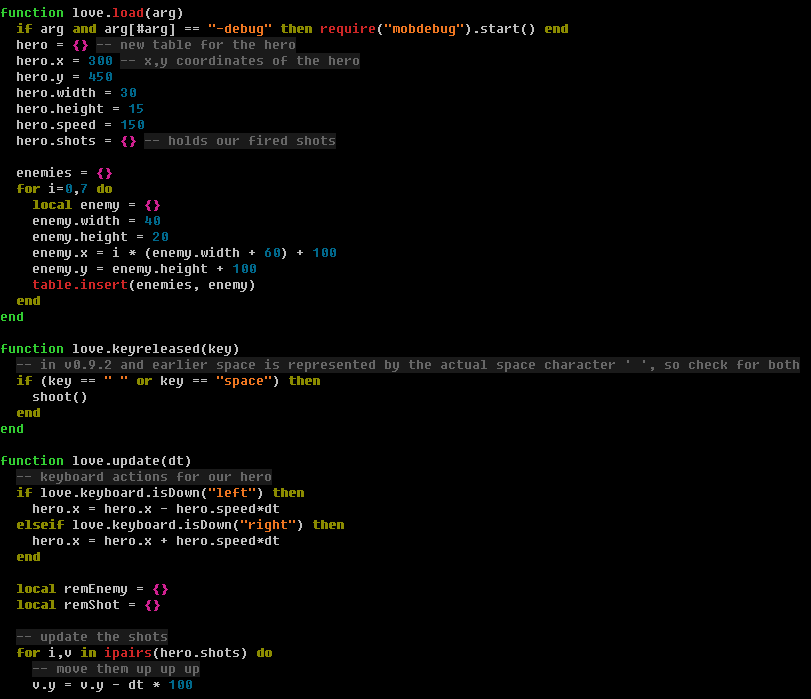

# Broduo Color Scheme

A dark color scheme for Vim.

## Install

Copy `broduo.vim` to your `~/.vim/colors` directory.

## Usage

To set **broduo** as your default color scheme, add `colorscheme broduo` to
your .vimrc file.

If you want to test the color scheme first, type `:colorscheme broduo` inside
Vim.

## License

Released under the *MIT License*. See LICENSE for details.

